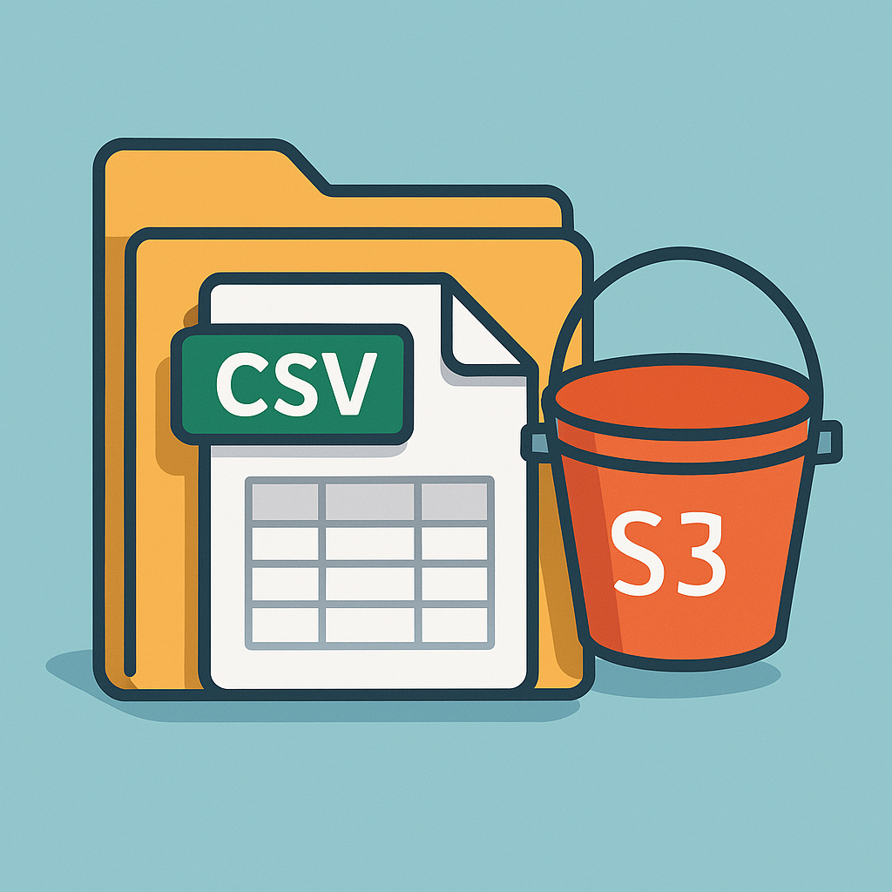

# BFF Handler S3

<div align="center">
  
</div>

## 📦 Overview

**BFF Handler S3** is a backend-for-frontend (BFF) application designed to handle large CSV file uploads to an S3-compatible storage, with advanced features like dynamic rate limiting, circuit breaking, retry logic, and health checks.

---

## 🚀 MVP Version

This version of the project is an **MVP (Minimum Viable Product)**. It includes the basic infrastructure and application setup to test the core functionality of the BFF Handler S3.

### Steps to Run the MVP

1. **Apply the Terraform Infrastructure**
   Navigate to the `./infra/terraform-mvp` directory and apply the Terraform configuration to set up the required infrastructure.

   ```bash
   cd ./infra/terraform-mvp
   terraform init
   terraform apply
   ```

   This will create the necessary S3 buckets, IAM roles, and other resources required for the application.

2. **Run the Application**
   Navigate to the `app` folder and run the application. Before running, make sure to create a `.env` file with the required environment variables.

   ```bash
   cd ./app
   touch .env
   ```

   Add the following properties to the `.env` file:

   ```env
   APP_USER=ADMIN
   APP_PASSWORD=ADMIN

   AWS_S3_BUCKET=bff-handler-<account_id>-main
   AWS_S3_BUCKET_BACKUP=bff-handler-<account_id>-fallback

   S3_RETRY_ATTEMPTS=3
   S3_FALLBACK_RETRY_ATTEMPTS=2

   S3_TIME_OUT=300000
   S3_CONN_TIME_OUT=60000

   CB_TIMEOUT=30000
   CB_THRESHOLD=50
   CB_RESET_TIMEOUT=10000

   MULTER_PATH_TMP=./tmp
   ```

   Replace `<account_id>` with your AWS account ID.

3. **Start the Application**
   Run the application using your preferred method (e.g., `npm start` or `yarn start`).

   ```bash
   npm install
   npm start
   ```

---

## 🔮 Features for the Future (Issues)

The following features are planned for future releases:

1. **GitHub Actions Workflow**

   - Automate the deployment process using GitHub Actions.
   - Include infrastructure provisioning and application deployment in the CI/CD pipeline.

2. **Containerize the Application**

   - Build a Docker image for the application.
   - Push the image to Amazon Elastic Container Registry (ECR).

3. **Complete Infrastructure Setup**
   - Deploy the application on **Amazon ECS** (Fargate) with an **Application Load Balancer (ALB)**.
   - Integrate the S3 buckets for file storage and replication.
   - Implement auto-scaling and monitoring for the ECS cluster.

---

## 🛠️ Development Notes

- This MVP is designed to validate the core functionality of the BFF Handler S3.
- Future iterations will focus on scalability, security, and automation.
- This project will be an article.
